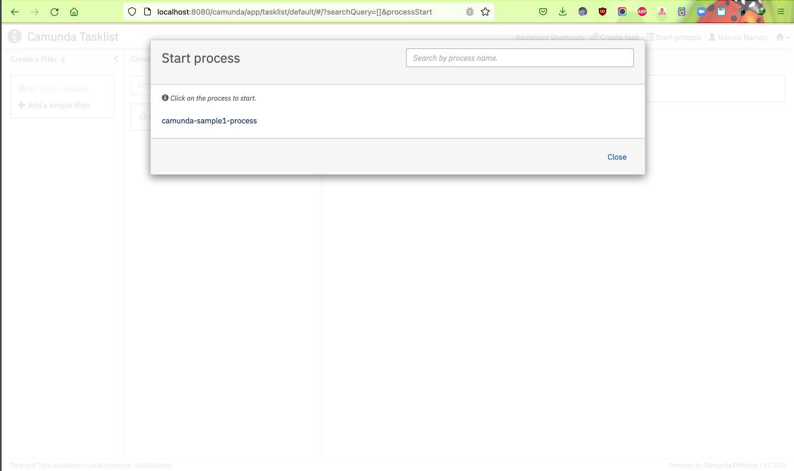

# spring-boot-camunda-sample1

### Running Spring Boot Application With Embedded Camunda Engine

I'm sure you're familiar with Camunda BPM or any other BPMN tools. In this article, we are going to have a quick look at
how to set up a Spring Boot application with Embedded Camunda Engine. To achieve this, I am going to get help from
Camunda BPM Initializr, which is a web-based tool to generate Spring Boot applications integrated with Camunda engine
capabilities.

Creating a Simple Spring Boot Project With Camunda Engine

1. Click on the link: [Camunda BPM Initializr](https://start.camunda.com/)

   

   Explanation:

    * Group: Fill a groupId for your project of your choice.
    * Artifact: Fill artifactId for your project of your choice.
    * Camunda BPM Version: Next, need to choose Camunda BPM Version from drop-down where multiple Camunda BPM versions
      are listed. For more details click Camunda BPM Versions.
    * H2 Database: For supported H2 Database, there are two different options given. Know more about H2 Database and
      Spring Boot by clicking here.
    * Java Version: Choose Java version from drop-down. For now, choose Java 8.
    * Camunda BPM Modules: Camunda BPM Modules can be added if there is need to add Camunda REST APIs or Camunda Webapps
      support in the application.
    * Spring Boot Modules: Additional Spring modules can be added.
    * Further, username and password can be set, which is required for example using a Camunda cockpit application
      login.
    * After filling the details, you can explore the project using "Explore Project" Option.

   

    * Finally, click on "Generate Project" and download the {{artifactname}}.zip and extract it in your local workspace.
2. Use IntelliJ IDEA/Eclipse IDE to run the project.
3. Run the application: `mvn clean spring-boot:run`
4. Starting process.bpmn using Camunda cockpit and tasklist web-apps. Open browser and enter
   URL http://localhost:8080/app/welcome

   Camunda Home Page

   

   Enter username/password and welcome to access the Camunda web-apps. Here we are going to use Cockpit and Tasklist
   mainly for this tutorial.

   

   

   

   

   

   

   

   

5. Before completing this process, have a look at the database schema and related entries.
6. Enter URL http://localhost:8080/h2-console in the browser.
   

7. Enter the JDBC URL and connect to see the Camunda Database where all the tables can be seen. Have a quick look at a
   few important tables.
   
   To check deployment: select * from ACT_RE_DEPLOYMENT To check running process: select * from ACT_RE_PROCDEF To check
   running task: select * from ACT_RU_TASK

8. Go to Tasklist and click on the claim and complete the task. Refresh the Cockpit and you can see the running process
   is completed.
9. Further, check out the below tables to see the history of the executed process and task where all the running tasks
   and processes are completed and having updated END_TIME_.

   To check the completed process: SELECT * FROM ACT_HI_PROCINST To check the completed task: select * from
   ACT_HI_TASKINST

So, we are able to run the Camunda process using Spring Boot.

Further, all Spring Framework lovers can modify the process as per your needs.

